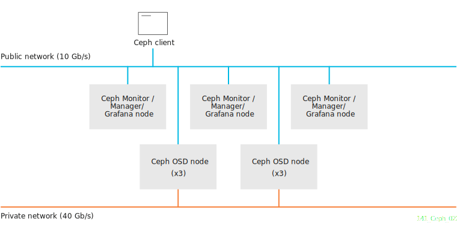

# readme (on working...)

[https://docs.redhat.com/en/documentation/red_hat_ceph_storage/4/html/installation_guide/red-hat-ceph-storage-considerations-and-recommendations#tuning-considerations-for-the-linux-kernel-when-running-ceph_install](https://docs.redhat.com/en/documentation/red_hat_ceph_storage/4/html/installation_guide/red-hat-ceph-storage-considerations-and-recommendations#tuning-considerations-for-the-linux-kernel-when-running-ceph_install)

[vagrant.md](docs/vagrant.md)

~~~bash
[mpatron@node0 ~]$ python3 -m venv ~/venv
[mpatron@node0 ~]$ source ~/venv/bin/activate
(venv) [mpatron@node0 ~]$ python3 -m pip install --upgrade pip
(venv) [mpatron@node0 ~]$ python3 -m pip install ansible
(venv) [mpatron@node0 ~]$ ansible --version
ansible [core 2.15.12]
  config file = None
  configured module search path = ['/home/mpatron/.ansible/plugins/modules', '/usr/share/ansible/plugins/modules']
  ansible python module location = /home/mpatron/venv/lib64/python3.9/site-packages/ansible
  ansible collection location = /home/mpatron/.ansible/collections:/usr/share/ansible/collections
  executable location = /home/mpatron/venv/bin/ansible
  python version = 3.9.18 (main, Jul  3 2024, 00:00:00) [GCC 11.4.1 20231218 (Red Hat 11.4.1-3)] (/home/mpatron/venv/bin/python3)
  jinja version = 3.1.4
  libyaml = True
(venv) [mpatron@node0 ~]$ deactivate
[mpatron@node0 ~]$
~~~
